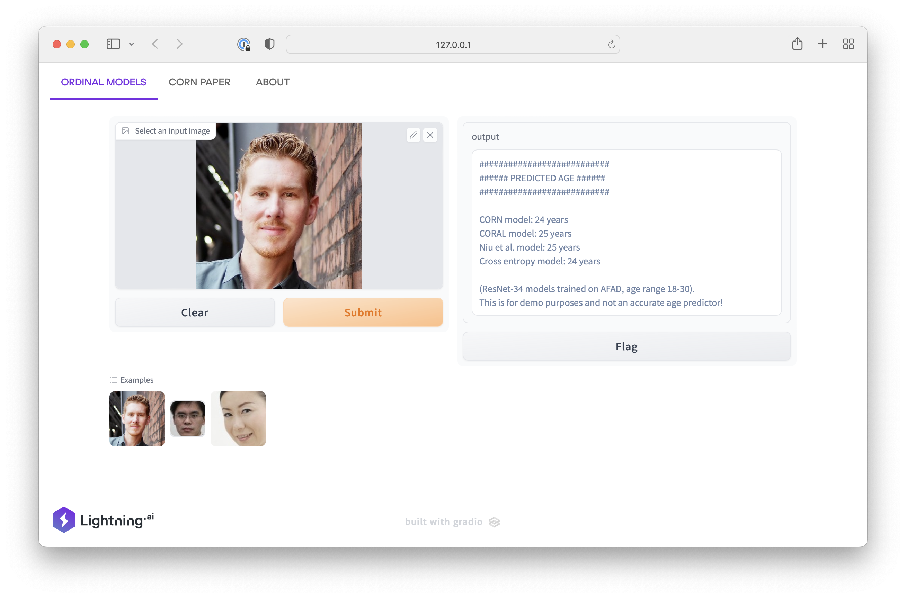

# scipy2022-talk


# Using the Code


### Step 1: Install the requirements

```bash
git clone https://github.com/rasbt/scipy2022-talk.git
cd scipy2022-talk
conda create -n coral-pytorch python=3.8
conda activate coral-pytorch
pip install -r requirements.txt
python -m spacy download en_core_web_sm
```

### Step 2: Run the code

MLP with CORN loss

```python
cd src
python main_mlp.py \
--batch_size 16 \
--data_path ../datasets/ \
--learning_rate 0.005 \
--mixed_precision true \
--num_epochs 40 \
--num_workers 3 \
--output_path ./cement_strength \
--loss_mode corn
```

MLP with cross entropy loss

```python
python main_mlp.py \
...
--loss_mode crossentropy
```


## More examples

- PyTorch Hub for loading pre-trained models: [https://github.com/rasbt/ord-torchhub](https://github.com/rasbt/ord-torchhub)
- Tutorials for using the various ordinal regression models with CNNs, RNNs, and MLPs: [https://github.com/Raschka-research-group/coral-pytorch](https://github.com/Raschka-research-group/coral-pytorch)
- The CORN paper repository with detailed experiment logs: [https://github.com/Raschka-research-group/corn-ordinal-neuralnet](https://github.com/Raschka-research-group/corn-ordinal-neuralnet)


## Interactive Demo

[](https://bit.ly/3aCgSeG)

You can try an interactive version at [https://bit.ly/3aCgSeG](https://bit.ly/3aCgSeG).


## References

- Xintong Shi, Wenzhi Cao, and Sebastian Raschka 
*Deep Neural Networks for Rank-Consistent Ordinal Regression Based On Conditional Probabilities.*
https://arxiv.org/abs/2111.08851